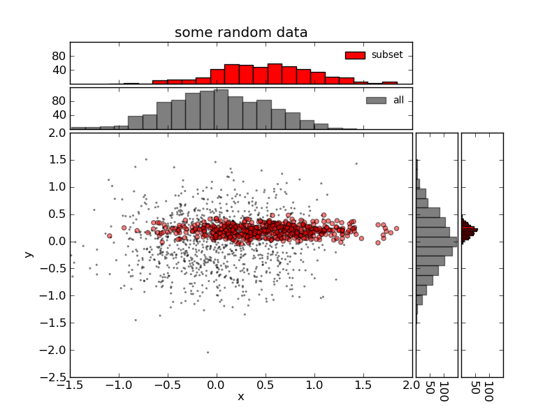

``marginalhists``
=================

This package helps create scatter plots with several data series along with
marginal histograms.

Example usage::

Create some example data::

    >>> import numpy as np
    >>> from matplotlib import pyplot as plt
    >>> x1 = np.random.normal(0, 0.5, 1000)
    >>> y1 = np.random.normal(0, 0.5, 1000)
    >>> x2 = np.random.normal(0.5, 0.5, 500)
    >>> y2 = (np.random.normal(0.2, 0.1, 500))

Set up a figure and axes, and then pass it to the MarginalHistScatter::

    >>> fig = plt.figure()
    >>> ax1 = fig.add_subplot(111)

    >>> from marginalhists import MarginalHistScatter
    >>> m = MarginalHistScatter(ax1)

Append data, configuring colors and styles for scatter and histograms
separately.  Each call to ``append()`` will add a new set of points to the
axes and will add new marginal histograms to the top and bottom::

    >>> m.append(x1, y1,
    ...     scatter_kwargs=dict(c='k', linewidths=0, alpha=0.5, marker='.'),
    ...     hist_kwargs=dict(label='all', color='k', alpha=0.5, bins=20))
    >>> m.append(x2, y2,
    ...     scatter_kwargs=dict(c='r', alpha=0.5),
    ...     hist_kwargs=dict(label='subset', color='r', bins=20))

Tweak axes as needed::

    >>> m.top_hists[-1].set_title('some random data')
    >>> m.scatter_ax.set_xlabel('x')
    >>> m.scatter_ax.set_ylabel('y')
    >>> plt.show()

